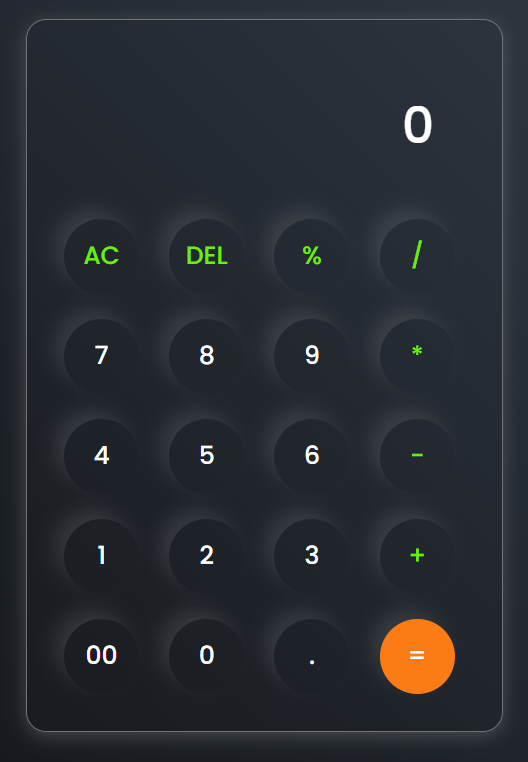

# Simple Calculator

A basic calculator built with **HTML, CSS, and JavaScript**. Perform **addition, subtraction, multiplication, and division** with a clean, responsive interface.

## Features

- Addition, subtraction, multiplication, and division
- Clear/Reset button
- Responsive design

## Technologies

HTML | CSS | JavaScript

## How to Use

1. Clone the repository
2. Open `index.html` in your browser
3. Start using the calculator
